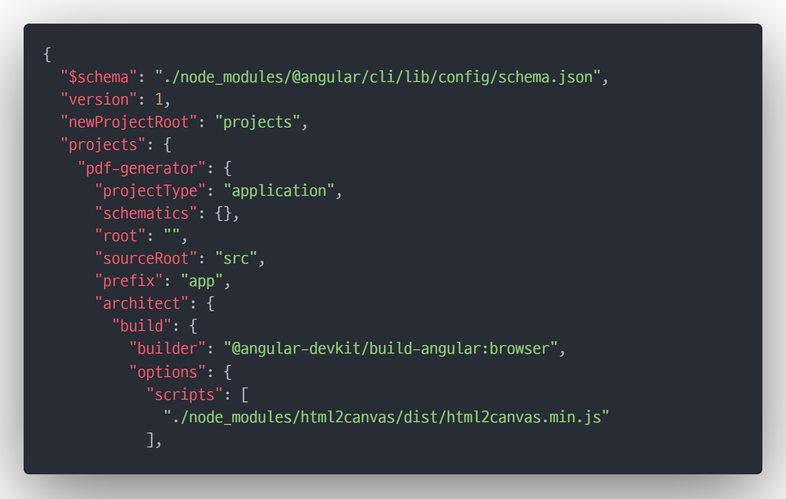

# PDF Generator

## 필수 패키지
+ html2canvas
+ jspdf
+ pdfjs-dist

## 사용법
1. angular.json의 scripts에 아래와 같이 html2canvas 추가
    ```json
    {
        ...
        "projects": {
            "project name": {
                ...
                "architect": {
                    ...
                    "build": {
                        ...
                        "options": {
                            ...
                            "scripts": [
                                "./node_modules/html2canvas/dist/html2canvas.min.js"
                            ]
                            ...
                        }
                    }
                }
            }
        }
    }
    ```
## 예시
